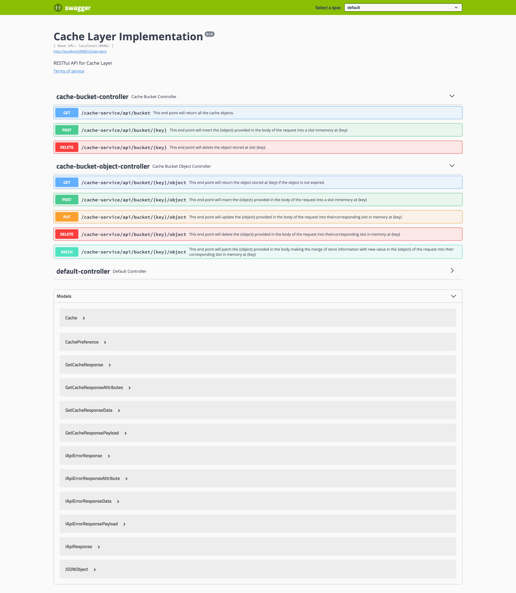

Cache Layer
===

This project is my own implementation of a cache layer, based on the details described in the
following [Backend_Take_Home_Assessment](Backend_Take_Home_Assessment.pdf)

<details>
<summary> Click to Expand details </summary>

> Your task is to create an in-memory cache with a REST interface.
> This cache will store JSON objects (strings) in the server’s memory that can be accessed via the API.
> For simplicity the server is single-threaded. The cache accepts the following configuration parameters:

* **Number of slots (int, default 10,000)**:

      Maximum number of objects to be stored simultaneously in the server’s memory.
      If the server runs out of slots it will behave according to the **Eviction Policy setting**

* **Time-To-Live (int, default: 3600 secs):**

      Object’s default time-to-live value in seconds if no TTL is specified as part
      of a write request. If TTL is set to 0 that means store indefinitely (until an explicit DELETE request)

* **Eviction Policy (enum, default: REJECT):**

      This indicates what to do when the cache runs out of slots. The following options are:

        ○ OLDEST_FIRST: If there are no slots available the cache will evict the oldest active object and store the new object in its place 
        ○ NEWEST_FIRST: If there are no slots available the cache will evict the newest active object first and store the new object in its place 
        ○ REJECT: When the cache runs out of storage it just reject the store request

> The REST API will support the following operations:


● **GET /object/{key}**

    ○ This will return the object stored at {key} if the object is not expired. 
        ○ Returns 
                  ■ 200: If the object is found and not-expired 
                  ■ 404: If the object is not found or expired 

● **POST or PUT /object/{key}?ttl={ttl}**

    ○ This will insert the {object} provided in the body of the request into a slot in memory at {key}. If {ttl} is not specified it will use server’s default TTL from the config, if ttl=0 it means store indefinitely 
        ○ Returns
                  ■ 200: If the server was able to store the object 
                  ■ 507: If the server has no storage 

● **DELETE /object/{key}**

    ○ This will delete the object stored at slot {key} 
        ○ Returns 
                  ■ 200: If the object at {key} was found and removed 
                  ■ 404: If the object at {key} was not found or expired

</details>

---

Technological stack
===

* Maven
* Docker
* Java 11
* Spring boot 2.5
* log4j2
* spring-boot-starter-aop

---

swagger pages
====

<details>
  <summary> Click to expand </summary>

> * http://localhost:8080/v2/api-docs

> * http://localhost:8080/swagger-ui.html


</details>

---

Docker Instruction
===
In order to create your own docker run the following command.

```shell
docker build . -t cache-layer && docker-compose up
```

---
Structure
===

The In-Memory cache structure is based on `Map` data structure:

```java
    Map<String, ICacheRepository>
```
The key is `String` passed as a Path Variable in the URL.
The value `ICacheRepository` is the interface that handle the Eviction cache policy.

The `ICacheRepository` has its custom implementation one per each eviction policy  
* **NewestFirstCacheRepository** -> implements `LinkedHashMap` 
  * Taking the `keySet` 
  * Convert into a list 
  * Subtract the elements to be replaced from the `List`
  * Remove the values from the bottom to top
  * Insert the new elements into the LinkedHashMap.
* **OldestFirstCacheRepository** -> Implements a `LinkedHashMap`
  * Override the `removeEldestEntry` method
* **RejectCacheRepository** -> Implements a `HashMap`
  * Add a singleton (enum) validator
  * Avoid the insertion

The structure in `ICacheRepository` is the following.
```java
    Map<String, JSONObject>
```
The key is a calculated value based on the possible properties into the provided json.
   * iterates over an array value from the yml file
  ```yaml
  cache:
    suggested-key-properties-ids-for-cache-object: id, ID, Id, iD, name
  ```
* if any property is present it will take it as a key, otherwise will take the `hashCode` value

The value is the json object provided.

---

The project has 3 endpoints:

| Name        | endpoint                                |usage  |
| ------------|:---------------------------------------:| -----|
| default     | `/`                                     | [project version , _health_check] |
| bucket      | `cache-service/api/bucket`              | Handle the parent container _(where the objects live)_  |
| objects     | `cache-service/api/bucket/{key}/object` | Handle the object operations |

#### BUCKETS

* `POST` `/cache-service/api/bucket/{key}`
  _This endpoint creates a bucket with specified key_
  ```json
  {
    "cachePreference": {
      "slotNumber": 5,
      "timeToLive": 0,
      "evictionCachePolicy": "REJECT"
    },
    "elements": [
      {
        "id": 1,
        "name": "jp"
      } ...
    ]
  }
  ```
* `DELETE` `cache-service/api/bucket/{key}`
  _This endpoint deletes a bucket with specified key_

* `GET` `cache-service/api/bucket`
  _This endpoint retrieve all the buckets in memory with their associated objects and cache preferences_

#### OBJECTS

_All the object endpoints expect the following structure in the body request section._

   ```json
  {
    "element": {
      "id": 1,
      "flag": true,
      "extra": 9
    }
}
   ```

* `POST` `/cache-service/api/bucket/{key}/object`
  _This endpoint adds objects into a bucket with specified key_

* `DELETE` `/cache-service/api/bucket/{key}/object`
  _This endpoint deletes object into a bucket with specified key_

* `PUT` `/cache-service/api/bucket/{key}/object`
  _This endpoint replaces object into a bucket with specified key_

* `PATCH` `/cache-service/api/bucket/{key}/object`
  _This endpoint Merges object into a bucket with specified key_


### cache preference
The cache preference has the following precedence:
1. The values provided in the body payload in `/cache-service/api/bucket/{key}`
2. The values provided in application.yml
  ```yaml
cache-service:
    preference:
      slotNumbers: 10
      timeToLive: 3600
      evictionCachePolicy: OLDER_FIRST
  ```
3. The default values mentioned in the pdf file.

---
Test
===
The easiest way is importing the [Postman Collection ](Postman-Collection/Cache-API.postman_collection.json)

---
Development
===
to run from source code you will need to add _variable environment_

```
APP_ENV=local
```

---